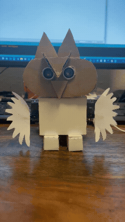
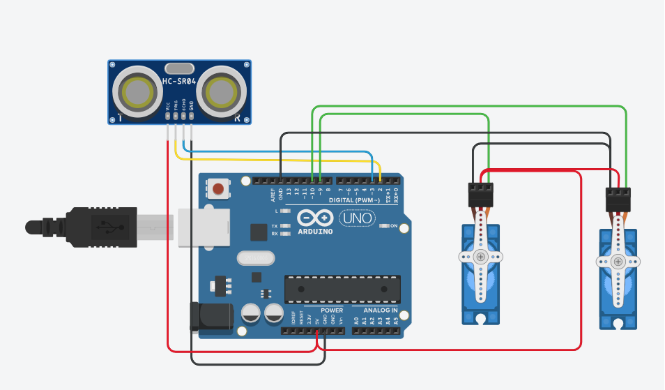
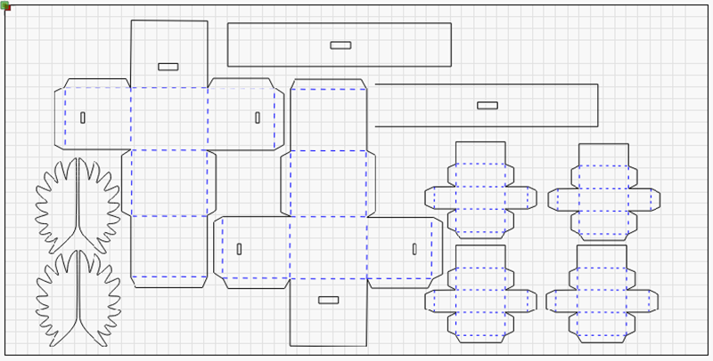

# Kleine-Eule

|[:skull:ISSUE](https://github.com/frankyhub/Kleine-Eule/issues?q=is%3Aissue)|[:speech_balloon: Forum /Discussion](https://github.com/frankyhub/Kleine-Eule/discussions)|[:grey_question:WiKi](https://github.com/frankyhub/Kleine-Eule/wiki)|
|--|--|--|
| | | | 
| <a href="https://github.com/frankyhub/Kleine-Eule/pulse" alt="Activity">| <a href="https://github.com/frankyhub/Kleine-Eule/graphs/traffic">  |<a href="https://github.com/frankyhub?tab=stars"> |

## Story
Dieses Repo beschreibt eine Bastelarbeit mit Pappe, einen Arduino NANO, zwei Servo Motoren SG90 und einen Ultraschallsensor HC-SR04. Die Servomotoren bewegen die Flügel der Eule sieben mal auf und ab, wenn man den Ultraschallsensor bis auf 5 cm nähert. 

## Hardware

|  Bauteil | Arduino-Pin | Beschreibung|
|--|--|--|
|  HC-SR04 |  VCC 5 V  |   Stromversorgung|
|  HC-SR04 |  GND GND  |   Masse|
|  HC-SR04  | TRIG  D2  |  Trigger-Pin|
|  HC-SR04 |  ECHO  D3 |   Echo-Pin|
|  Servo 1 |  Signal  D9 | Linker Flügel|
|  Servo 2 |  Signal  D10| Rechter Flügel|
|  Servos |   VCC   |      Externe 5 V |
|  Servos  |  GND  | GND    (gemeinsam mit Nano)  Masse|
|--|--|--|

---

## Verdrahtung

---

## Körper aus Pappe

---
---

   
<ol class="breadcrumb" style="border-top: 2px solid black;border-bottom:2px solid black; height: 45px; width: 900px;"> 
<a href="#oben">nach oben</a>
</ol>

  

---

